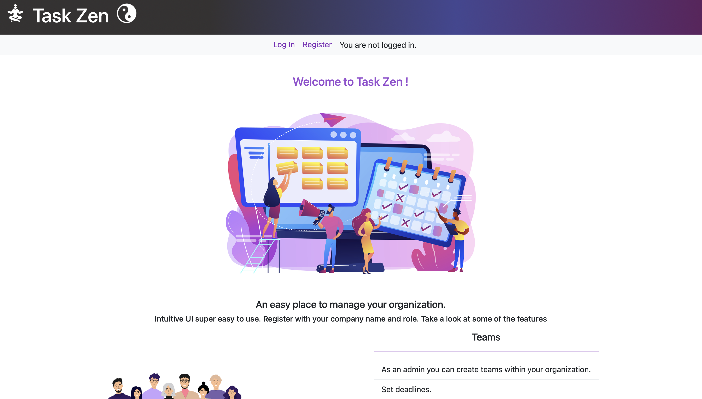

# Task Zen

This web application provides tools to manage your company or organization. An intuitive task manager, easy to use and user friendly.  
Company managers can create teams and group employees. Create projects and tasks, multiple tasks can be grouped into projects. Set deadlines and assign tasks to employees. Employees must upload relevant files and submit for review once ready.  
Reviewers are notified (in-app) when tasks are ready for review.

## Features

- Dashboard  
  An overview of the user. A status card displays the total, completed, pending and missed tasks counts. For admins you will see a card with 4 most recent projects teams and projects if any. There are 2 more cards which show 4 urgent tasks (due in less than 3 days) and 4 missed deadline tasks.  
  Finally admins can see a list of managed teams and employees will see the teams they belong to.

---

- Teams  
  See a table of company teams and filter between "all" and "my teams" (employees) or "managed"(admin).  
  Admins will also see a `add a new team` button and a column called actions will display the avaliable actions. Click on each team to see the detailed info. The edit and delete actions will appear if you are the team manager.

---

- Projects  
  This feature is only avaliable for `Admin` and `Manager` roles, users with single `Employee` role won't be able to access the projects pages.
  A "create new project" button will be visible on the top right corner.
  Users can view a list of projects if any, with edit and delete actions.
  Create a project and add multiple tasks. Clicking on eache project of the list will take you the project detailed view, where there's also a progress bar representing the completed tasks and %.

---

- Tasks  
  See all company tasks, create, edit and delete . Note the create, edit and delete features are only avaliable for `Admin` and `Manager` roles, whereas users with single `Employee` role will still see all tasks with visibilty `public`. The visibility field dictates whether the employees can see tasks, even if the task is assigned to the user **it must be `public`** for the empoyee user to see it.

---

- Reviews  
  Users wit `Admin` and/or `Manager` roles can create, edit and delete task reviews. Task reviews are also displayed for users with single `Employee` role .

---

- Responsiveness:  
  The app is fully responsive from mobile screens to desktop. It uses mainly [Bootstrap 5](https://getbootstrap.com/) with some custom css classes.

---

## Distinctiveness and Complexity

I strongly consider that this appication distingish from any of my previous projects in several aspects.

The most notably distiction is that I used react and [react-router-dom](https://reactrouter.com/en/main) for the frontend.

The Django application in this project only serves one template, (which is the production build of a react app). Django is effectively an API that interacts with the database and client requests in harmony. This setup also adds extra developing requirements for example certain routes must be protected on the client and on the backend.

Aditionally is worth noting that the Django views are [class based views](https://docs.djangoproject.com/en/5.0/topics/class-based-views/#:~:text=Class%2Dbased%20views%C2%B6,by%20harnessing%20inheritance%20and%20mixins.) rather than function based views used in all my previous projects. They return json responses containing serialized data.

This application is configured to serve static files in production, thanks to [WhiteNoise middleware ](https://whitenoise.readthedocs.io/en/latest/). Although for serving media files in production further configuration is requred.

As for complexity, the frontend and backend are two separate apps. Django provides a robust backend,while the frontend is a react SPA (single page app) which provides client side navigation. During development the frontend and backend run in different ports, demanding the need for cors handling. I succesfully integrated react with Django to work seamlessly, with the help of `django-cors-headers`, django sessions and csrf protection. This setup has exceeded the complexity of any prevoius projects.

The Django app has 10 models with different relationships between them, making the database queries more complex than in previous projects.

I also incorporated tasks filters in the frontend and the logic to filter the data accordingly in the backend API view.

There's a pagination element on the frontend that does not trigger a document reload, instead the page just fetches the new page data.

The application has serializers defined for each model, which provide a more consistent data parsing approach.

In addition to the above, this application is fully mobile responsive.

### About **Task Zen**

**Task Zen** is built with **Django 5.0.3** and **React 18.2.0**. The react frontend relies on **`react-router-dom 6.22.3`** for client side routing and takes advantage of the data api.

## Files and directories

Here's an overview of the most relevant directories and files I created. Please note that not all the files are explained here .

- ### Backend:

  - `media`- empty directory for media uploads storage
  - `task_manager`- the main django project directory which contains `settings.py` and the project's `urls.py` (among other files).
  - `tasks`- the django project application, consists of:
    - `templates`- there's a subdir called `tasks` that contains the html document linked to the static react build files.
    - `models.py`- 10 data models for 'User', 'Task', 'Project', 'Company', 'Team', 'TeamManager', 'TaskReview', 'Role', 'Attachment'and 'TaskComment'.
    - `serializers.py`- we defined serializers for each data model to send the data over json.
    - `urls`- defines the urls associated for our views.
    - `views`- api views that handle data and one template view that serves the html template.

---

- ### Frontend:
  - `react/public`- contains images used in the app.
  - `react/src`
    - `api/fetch.js`- reusable function for data fetching.
    - `components`- this directory contains UI components organised by "page" category that are used in each page.
    - `routes`- each file is a page corresponding with the routes defined in App.jsx.  
      Each page also contains a loader and action functions, which are the tolls for managing data fetching and mutations. For more info plesase visit [react router](https://reactrouter.com/en/main/start/overview).
    - `styles`- css file and scss override some [Bootstrap variables](https://getbootstrap.com/docs/5.3/customize/css-variables/).
    - `utils`- this directory includes a number of files with helper functions (e.g. `cookie.js` defines the functions to obtain/handle the CSRF token).
    - `App.jsx`- here we define the router and associate each page, we import all pages along with loaders and actions from `routes`
    - `main.jsx`- in this file we bind the react app with the div 'root' from `index.html`.

## How to run Task Zen

Follow this steps to run the application in your local machine:

1.  Clone the repository. Run `git clone https://github.com/Moonflower-labs/taskZen.git` in your terminal. Move to the root directory `cd taskZen`.
2.  Set up the frontend:
    - Once you are in the project root directory, change directory to `react` with `cd react`.
    - Install react dependencies. From the `react` directory run `npm i` or `npm install`.
    - Build app for production by running `npm run build`. A directory called `**dist**` will be generated with all the production content. (Our Django backend is already set up to access this files).
3.  Go back into the root directory (`cd ..`) and set up the backend:

    - Install Django dependencies. Run `pip install -r requirements.txt`.
    - Initialise database by running the following commands:

          python manage.py makemigrations
          python manage.py migrate

    - Optionally you can create a superuser with `python manage.py createsuperuser` for acces to Django admin interface.
    - Collect static files **(only needed for production)**: run `python manage.py collectstatic`.
    - Finally start the server `python manage.py runserver`.

4.  Open http://127.0.0.1:8000/ in your browser.

You should see the the following page:

Congratulations! You have succesfully installed the appication. Now you are ready to start using Task Zen.

## Next steps

### About the application

You must register and log in to access the features of **Task Zen**.

When registering a new user you must enter a company name and choose your role (admin, manager or employee). This is for the sake of simplicity an in a real life use case the company would handle role assignment. Please **note that currently manager and admin have the same permissions so there's no distiction between the two roles**.

The company name provided at registration will be used by the application to identify and retrieve data belonging to a certain company, group or organization.

In order to try out all the features at least one user with role "Manager"/"Admin and one user with the role "Employee" must be registered, although it is recommended to register more users of various roles.

For more detailed iformation keep reading the bellow section.

### How to use the application

### Registration (create two users):

Go to register and fill in the form. Enter a company name and check "Employee" is selected in the role field. Click "Register". Upon succesfully registration you will be logged in and your dasboard will be loaded. At this moment there's no data to show yet. Just click "Log out" and register another user as "Admin" or "Manager".

Click register and fill in the form. Enter **the same company name as the previous user** and make sure you select either "Manager" or "Admin" in the role field. Click "Register".

Feel free to create as many users as you like.

---

#### Using Task Zen as a "Manager" or "Admin"

### Tasks

Upon logging in your dasboard will be loaded. The company name will be visible in the header. There won't be any data to display yet so go ahead and click `tasks` in the navigation bar.

#### 1. Create tasks

Click the button "Add a new task" and fill in the form. Note that if at this point there aren't any other users registered with the same company name, you will only be able to assign the task to yourself or leave it blank by selecting "None". When you are ready click "create" and the new task will pop up in the list along with a self dismissable alert.

Click on the task and you'll be directed to the relevant task page where the details are display along with some actions "Edit", "Delete", "Mark complete", "Upload".

We will explain below, first go back and create a few tasks and assign to users.

#### 2. Edit tasks

You can access the "Edit" feature straight from the task list by clicking the pencil icon or from the task detail page by clicking the "Edit" button.

In the edit page a form will be filled with the current task data. Modify any data and click "Save changes". You will be redirected to the task page reflecting the changes made.

#### 3. Delete tasks

You can delete tasks from the task list by clicking the bin icon or from the task detail page by clicking the "Delete" button. Confirm the prompt and, if you were in the detail page, you will be redirected to the tasks (list) page.

#### 4. Upload files to tasks

For an assignee to submit a task for review, there must be at least one attachment uploaded to the task.
The only people allow to upload files to a task are: the admin that created the task and the task assignee.

In the detail page click the button "Choose files" and select the file/s to upload, the click "Upload". A thumbnail should appear in the "Attachments" section with the option to delete.

#### 4. Change tasks status

The admin and task author can change the task status from the task list or detail page. Just click on "Mark complete/Unmark" button. This will toggle the task status between "pending" and "complete" and will override any other status (e.g. "reviewing").
NOTE: There's no need to use this initially as it is handled by the application. E.g. when an "approved" task review is issued the task status of the associated task will automatically change to "complete".

### Projects

The projects feature allows the admin user to group multiple tasks and view the progress. At this times projects are not assignable like tasks.

#### 1. Create a project

Click the button "Create a project". Fill in the name and description. Select multiple tasks (if created previously) and then click "create". The new project will pop up in the list along with a self dismissable alert.

Click on the project from the list and you'll be directed to the detailed project page where the details are display along with the actions "Edit" and "Delete".

Note the progress bar (empty at the moment) bellow the project name. The bar will fill as tasks status change to complete.

#### 2. Edit projects

You can access the edit your project from the project list by clicking the pencil icon or from the project detail page by clicking the "Edit" button.

You will be directed to a page where a form will be filled with the current project data. Modify any data and click "Save changes". You will be redirected to the project page reflecting the changes made.

#### 3. Delete project

You can delete projects from the project list by clicking the bin icon or from the project detail page by clicking the "Delete" button. Confirm the prompt and, if you were in the detail page, you will be redirected to the projects (list) page.

### Teams

This feature allow you to goup employees into deparments, helping you to organise your company.

#### 1. Create teams

Click the button "Add a new team" and fill in the form. Add employees and click "create". The new team will pop up in the list along with a self dismissable alert.

Click on the team to see the detail team page where the details are display along with the "Edit" and "Delete" actions.

#### 2. Edit teams

The "Edit" feature is avaliable in the team list by clicking the pencil icon and also in the team detail page.

In the edit page a form will be filled with the current team data. Modify any data and click "Save changes". You will be redirected to that team page reflecting the changes made.

#### 3. Delete teams

You can delete teams from the team list or from the team details page by clicking the bin icon. Confirm the prompt and, if you were in the detail page, you will be redirected to the team (list) page.

### Reviews

Once a task has been submitted for review (by the assignee), the admin author of the task can create the pertinent review. You will see a coloured badge with a number in the navigation menu over the "Reviews" link, indicating the number of tasks awaiting for your review. Click on "Reviews" and in the page you will see a list of tasks ready for review (if any), and the message "No reviews to display yet".

#### 1. Create a review

Click the button "Review a task". Select the task from the dropdown,add your comments and select the status. Click "create". The new review will pop up in a list along with a self dismissable alert.

Click on the review from the list to open the detail review page.  
The actions "Edit" and "Delete" are avaliable both in the list and detailed review pages.

NOTE: **When a review status is "Approved" the related task status will automatically change to "complete"**.

#### 2. Edit a review

Click edit to open the form filled with the task review data. Modify any data and click "Save changes". You will be redirected to the review detailed page reflecting any changes made.

NOTE: **The related task status will also update accordingly. E.g. if you edit a review and change status from "Approved" to "Rejected" or "Pending", the task status will change from "Complete" to "Pending". The assignee will see an indicator in the "Tasks" tab in nav menu an he will be able to upload new files and re submit the task**.

#### 3. Delete a review

Click the bin icon and confirm the prompt. If you were in the detail page, you will be redirected to the Reviews (list) page.

---

### Using Task Zen as an "Employee"

#### Dasboard

In the Dashboard you will see the following:

- Total tasks, completed tasks, pending tasks and missed tasks count.
- Up to 4 urgent tasks (due in less than 3 days)
- Up to 4 missed deadline tasks.
- A list of the teams you belong to if any.

#### Tasks

In the "Tasks" page by default tha app will load your assigned tasks. If there are any a list of tasks will be displayed otherwise a message.  
Click on "Filters" to apply the following filters: priority, other, status and a input search. The user can explore other company tasks as long as the visibility is set to "Public".  
Click on each task of the list to go to the task detail page.
When viewing an assigned task you will be able to upload files **in order to submit the task for review it is required that at least one attachment is uploaded**.  
Upon uploading an attachment the assignee will see a "Submit for review" button. When you click the button the upload action will no longer appear and the task status will change to "Reviewing".
There's also a comment section for task related discussions.

When tasks are avaliable to submit (they have at least one attachment), you will see a coloured badge withe the amount of "potentially" ready to submit tasks.

#### Teams

Users can also explore the company teams and view their members.

#### Reviews

In the review page you can see a list of company reviews and click on each for the detailed page.

---

Thanks for taking the time to read this docs. I hope you found them satisfactory and also many thanks to everyone who makes posible the cs50 courses specially to Brian. I'll see you all on the other side!
